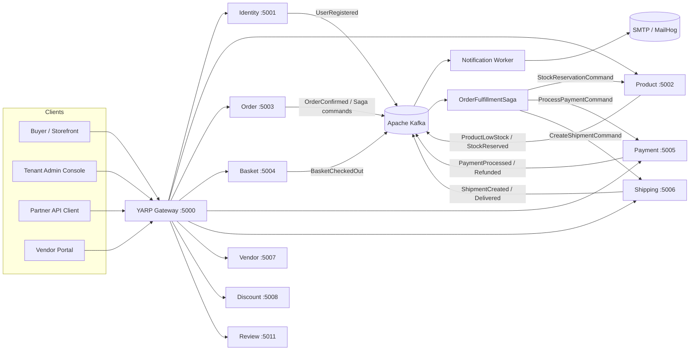
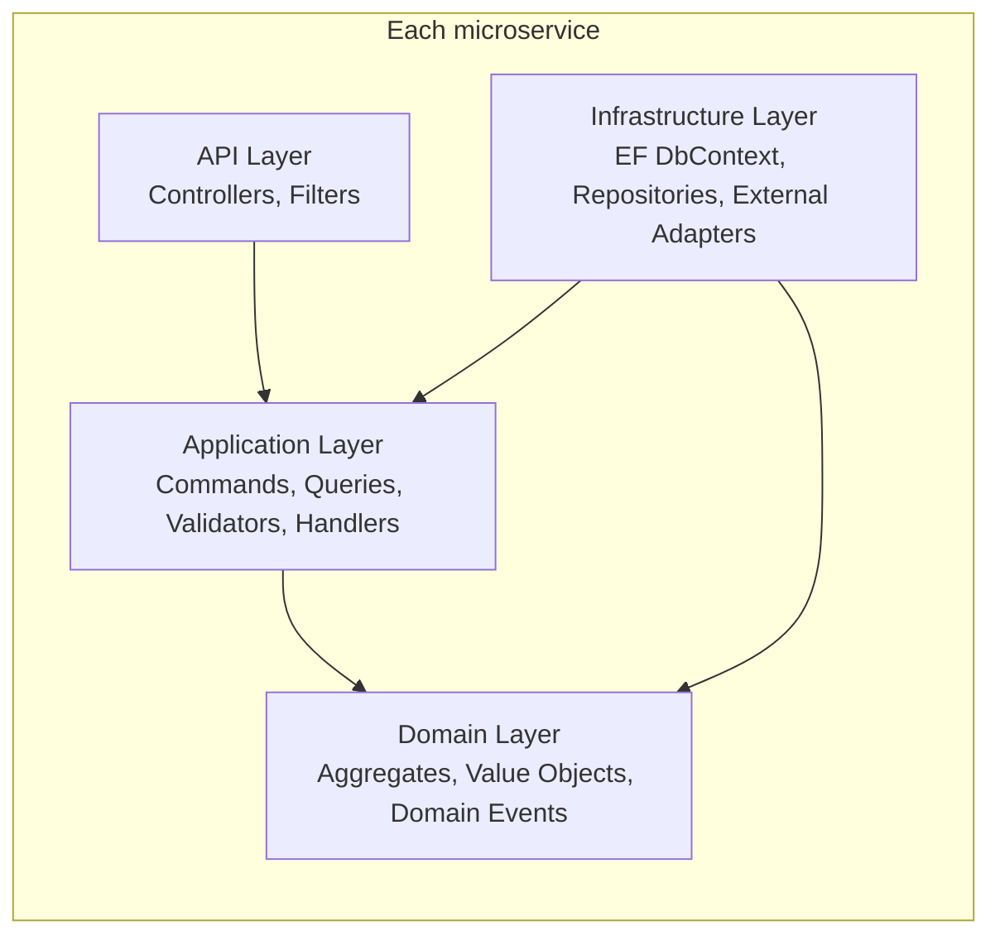
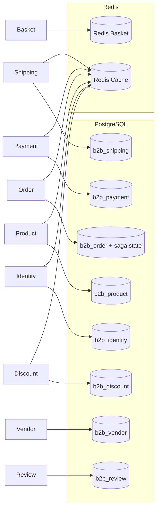
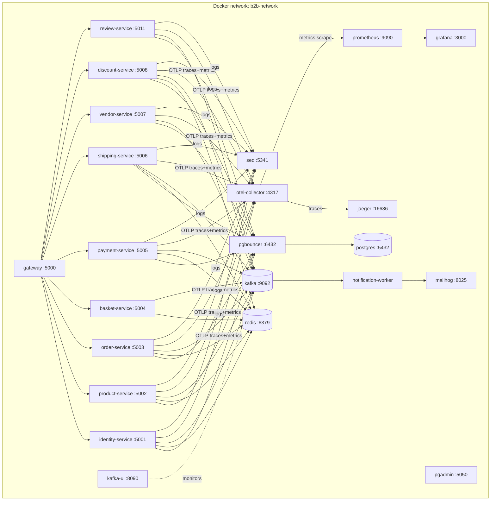

# High-Level Design — B2B Microservice Platform

| Field | Value |
|---|---|
| Document type | High-Level Design (HLD) |
| Companion docs | [BRD](BRD.md), [LLD](LLD.md) |
| Last revised | 2026-04-30 |

---

## 1. Architectural Style

- **Microservices** with bounded contexts: Identity, Product, Order, Basket, Payment, Shipping, Vendor, Discount, Review, Notification.
- **API Gateway** (YARP) as the single public ingress with per-IP rate limiting.
- **Database-per-service** (PostgreSQL): `b2b_identity`, `b2b_product`, `b2b_order`, `b2b_payment`, `b2b_shipping`, `b2b_vendor`, `b2b_discount`, `b2b_review`. Services do not share schemas.
- **Basket** is the sole exception — it uses Redis as its only data store (intentionally ephemeral).
- **Asynchronous integration** via Apache Kafka + MassTransit Kafka Rider for cross-service events.
- **Clean Architecture** within each service: Domain ← Application ← Infrastructure ← API.
- **CQRS** via MediatR 12 with a full pipeline of 8 behaviors (in registration order):
  `Logging → Retry → Idempotency → Performance → Authorization → Validation → Audit → DomainEvent → Handler`
- **Multi-tenant** by `TenantId` row scoping; resolved from JWT claims on every request. Entities that implement `ITenantEntity` receive an automatic global EF Core query filter — no per-query `.Where` required.
- **Saga** — `OrderFulfillmentSaga` (MassTransit state machine) orchestrates stock reservation, payment, and shipment with compensating rollback.

## 2. Context Diagram

## 3. Service Catalogue

| Service | Port | Database | Purpose |
|---|---|---|---|
| Gateway | 5000 | — | Routing, JWT validation, rate limiting, health |
| Identity | 5001 | `b2b_identity` | Tenants, users, auth, JWT issuance |
| Product | 5002 | `b2b_product` | Catalog, categories, stock, stock reservation |
| Order | 5003 | `b2b_order` | Orders, lifecycle, totals, fulfillment saga |
| Basket | 5004 | Redis only | Ephemeral basket, coupon apply, checkout |
| Payment | 5005 | `b2b_payment` | Payments, invoices, refunds |
| Shipping | 5006 | `b2b_shipping` | Shipments, carrier tracking, dispatch, delivery |
| Vendor | 5007 | `b2b_vendor` | Vendor registry, approval, lifecycle |
| Discount | 5008 | `b2b_discount` | Discount rules, coupon codes, validation |
| Review | 5011 | `b2b_review` | Product reviews, moderation |
| Notification Worker | — | — | Consumes integration events, sends email (9 consumer types) |

## 4. Logical Architecture (per service)

Dependency rule: arrows always point inward. The Domain layer has zero outward dependencies; Infrastructure provides the implementations of Application's port interfaces.

**Basket** follows the same Clean Architecture shape but substitutes EF Core + PostgreSQL with a Redis-backed `IBasketRepository` — the Application layer remains agnostic of the store type.

## 5. Cross-Cutting Concerns

| Concern | Mechanism | Owner module |
|---|---|---|
| Authentication | JWT bearer, validated at the gateway and re-validated at each service | `B2B.Shared.Infrastructure.Extensions.AddJwtAuthentication` |
| Authorization | Role claims on JWT + `AuthorizationBehavior` pipeline resolving `IAuthorizer<TRequest>` implementations via DI | `AuthorizationBehavior` + `IAuthorizer<>` per command |
| Multi-tenancy | `ICurrentUser.TenantId` from JWT; automatic global EF filter on every `ITenantEntity`; background services use `IgnoreQueryFilters()` explicitly | `BaseDbContext` global filter + `ITenantEntity` |
| Validation | FluentValidation auto-discovered per assembly; runs in `ValidationBehavior` pipeline | `ValidationBehavior` |
| Idempotency | Marker interface `IIdempotentCommand` + Redis-backed `IdempotencyBehavior` | `IdempotencyBehavior` |
| Retry | Three-layer Polly 8 pipeline: Bulkhead (`SemaphoreSlim` per command type) → Circuit Breaker (fail-fast when error rate high) → Retry (exponential + jitter); returns `Error.ServiceUnavailable` (HTTP 503) on bulkhead saturation or open circuit | `RetryBehavior` + `CommandBulkheadProvider` |
| Performance | Warning logged when handler exceeds threshold in `PerformanceBehavior` | `PerformanceBehavior` |
| Audit | Command metadata written to audit log in `AuditBehavior` | `AuditBehavior` |
| Logging | Serilog → Console + Seq, request-name + elapsed ms in `LoggingBehavior` | Serilog + `LoggingBehavior` |
| Tracing | OpenTelemetry → OTLP → OTel Collector → Jaeger; ASP.NET + HttpClient + EF Core instrumented | `AddServiceOpenTelemetry` extension |
| Metrics | OpenTelemetry → OTLP → OTel Collector → Prometheus scrape → Grafana dashboards; Runtime + EF Core instrumented | `AddServiceOpenTelemetry` extension |
| Health | Split `/health/live` (always 200) + `/health/ready` (Postgres + Redis tagged `"ready"`); Kafka validated at startup by MassTransit Rider host; gateway active health checks every 10s | `AddDefaultHealthChecks` + YARP config |
| Caching | L1: `HybridCache` in-process (2 min); L2: Redis via `ICacheService` cache-aside (15 min HybridCache / 5 min manual) | `HybridCache` + `RedisCacheService` |
| Response compression | Brotli (preferred) + Gzip for JSON responses | `AddResponseCompression` in `UseSharedMiddleware` |
| Output caching | Base 10s policy + named `"queries"` policy (30s, vary by page/pageSize/tenantId) | `AddOutputCache` in `AddSharedInfrastructure` |
| Messaging | MassTransit + Apache Kafka Rider; in-memory outbox per consumer | `MassTransitEventBus` |
| Rate limiting | Per-tenant sliding window (1,000 req/min; partitioned by `X-Tenant-ID` header → JWT claim → IP fallback) + per-IP fixed window at gateway | `AddRateLimiter` in Gateway |
| DB connection pooling | PgBouncer transaction-mode pool: 5,000 client connections → 50 server connections per DB; all services connect via PgBouncer `:6432` | `pgbouncer` Docker service |
| Stuck saga detection | `StuckSagaCleanupWorker` scans every 5 min for saga rows past 3× configured timeout; logs at Warning | `B2B.Order.Infrastructure.Workers` |

## 6. Communication Patterns

| Direction | Pattern | Channel |
|---|---|---|
| Client → Gateway | Sync HTTP/JSON | YARP, port 5000 |
| Gateway → Service | Sync HTTP/JSON | Service container DNS, port 8080 |
| Service → Service (data) | **Not allowed.** Services do not call each other directly | — |
| Service → Service (events) | Async pub/sub | Apache Kafka topics, MassTransit Kafka Rider consumers |
| Order Saga → Product | Async command (StockReservationCommand) | In-memory bus (same-process) |
| Order Saga → Payment | Async command (ProcessPaymentCommand) | In-memory bus (same-process) |
| Order Saga → Shipping | Async command (CreateShipmentCommand) | In-memory bus (same-process) |
| Service → Worker | Async pub/sub | Apache Kafka topics (`b2b-order-*`, `b2b-user-*`, etc.) |

The "no direct service-to-service calls" rule enforces autonomy and avoids latency stacking. Cross-service workflows are orchestrated through the saga.

## 7. Data Architecture

- Each service migrates and owns its own schema.
- Saga state (`OrderFulfillmentSagaState`) persists in `b2b_order` via EF Core, enabling saga resumption after a crash.
- No FKs cross databases; cross-aggregate references are by ID only.
- Basket has **no relational backing store** — Redis is its system of record by design.
- Redis is shared as a *cache* for other services — keys are namespaced per service (e.g. `products:tenant:{id}:page:{n}`).

## 8. Tech Stack

| Layer | Choice |
|---|---|
| Runtime | .NET 9, C# 13 |
| Web | ASP.NET Core 9 |
| ORM | EF Core 9 (Npgsql provider) |
| Mediator | MediatR 12 |
| Validation | FluentValidation 11 |
| Mapping | Mapster 7 |
| Reverse proxy | YARP 2.2 |
| Auth | JWT Bearer + BCrypt password hashing |
| Cache (L1) | `Microsoft.Extensions.Caching.Hybrid` 9.0.3 — in-process 2 min, stampede-safe |
| Cache (L2) | Redis 7 + StackExchange.Redis (HybridCache backend + `ICacheService` cache-aside) |
| DB pooling | PgBouncer 1 (bitnami) — transaction mode, 5,000 client / 200 server connections |
| Messaging | Apache Kafka 3.7 KRaft + MassTransit 8.3 Kafka Rider (including Saga state machine) |
| Logging | Serilog → Seq |
| Tracing | OpenTelemetry → OTLP → OTel Collector → Jaeger |
| Metrics | OpenTelemetry (Runtime + EF Core) → OTLP → OTel Collector → Prometheus → Grafana |
| Resilience | Polly 8 — three-layer: `SemaphoreSlim` Bulkhead + Circuit Breaker + Retry |
| Container | Docker, docker-compose for local |
| Tests | xUnit, FluentAssertions, NSubstitute, Bogus, Testcontainers |

## 9. Deployment Topology (local)

## 10. Scaling Strategy

| Axis | Approach |
|---|---|
| Read traffic | HybridCache (L1 in-process + L2 Redis); cache-aside via `ICacheService`; read replicas on PG when needed |
| Write throughput per service | Horizontal scale-out behind gateway; stateless API processes |
| Worker throughput | Multiple worker replicas as competing Kafka consumers in consumer group `b2b-notification-worker`; partition count determines max parallelism |
| Saga concurrency | Optimistic concurrency (`ConcurrencyMode.Optimistic`) on saga state rows; EF retry on conflict |
| Basket throughput | Redis atomic operations (HSET, HDEL); horizontal Redis cluster when needed |
| Hot tenant | Per-tenant sliding window rate limit at gateway (1,000 req/min, partitioned by `X-Tenant-ID`) |
| DB connections | PgBouncer transaction-mode pool (5,000 client → 200 server connections) fronts all PG databases |
| Concurrency isolation | `CommandBulkheadProvider` — per-command-type `SemaphoreSlim`; rejects excess requests instantly (HTTP 503) |
| Fault tolerance | Circuit Breaker (break at 50% failure over 10s) prevents cascade failure; auto-recovers after 30s |
| Response bandwidth | Brotli/Gzip compression on all JSON responses; output caching (30s) for list queries |
| Event throughput | One Kafka topic per integration event type; partition key for per-key ordering; consumer group `b2b-notification-worker` for competing consumers |

## 11. Security Architecture

- **Edge auth.** Gateway validates JWT signature, issuer, audience, lifetime.
- **Defence-in-depth.** Each service re-validates the JWT against the same secret.
- **Pipeline auth.** `AuthorizationBehavior` enforces role-based access at the command/query level before handlers execute.
- **Password storage.** BCrypt with cost factor as configured in `BcryptPasswordHasher`.
- **Secrets.** All credentials are environment variables; defaults shipped only for the local docker-compose stack.
- **Tenant isolation.** Every query filters by `ICurrentUser.TenantId`. Code review checklist enforces this.
- **Transport.** TLS terminated at the gateway in production. Inside the cluster, plain HTTP between gateway and services is acceptable when the network is private.
- **Refresh tokens.** Maximum 5 concurrent active tokens per user; oldest revoked when limit exceeded; all revoked on logout.

## 12. Observability

| Signal | Sink | Tool |
|---|---|---|
| Logs | Seq (`http://seq:5341`) | Structured JSON via Serilog |
| Traces | OTel Collector → Jaeger (`http://jaeger:16686`) | OTLP exporter (gRPC :4317) |
| Metrics | OTel Collector → Prometheus (`http://prometheus:9090`) → Grafana (`:3000`) | OTLP exporter; Runtime + EF Core instrumentation |
| Health (liveness) | `/health/live` — always 200 | Immediate response, no dependency checks |
| Health (readiness) | `/health/ready` — Postgres + Redis | UIResponseWriter, tagged `"ready"`; Kafka validated at startup by MassTransit Rider host |

Every inbound request gets a W3C trace context that propagates through HTTP and Kafka message headers, so a single `traceId` covers Gateway → Order Service → Kafka → Notification Worker → SMTP.

## 13. Reliability Patterns

| Pattern | Status | Detail |
|---|---|---|
| Message retry | ✅ Active | `cfg.UseMessageRetry(r => r.Intervals(100, 500, 1000, 2000, 5000))` |
| PG transient retry | ✅ Active | `npg.EnableRetryOnFailure(3)` per DbContext |
| In-memory outbox | ✅ Active | At-least-once within a single message handler scope |
| Idempotency cache | ✅ Active | 24h TTL on command pipeline |
| Health-check gating | ✅ Active | Gateway removes unhealthy nodes from routing; split live/ready endpoints |
| Saga compensating transactions | ✅ Active | Stock release, payment refund, or shipment cancel on any step failure |
| Saga timeouts | ✅ Active | In-memory bus built-in scheduler; auto-cancels stalled orders |
| Stuck saga cleanup | ✅ Active | `StuckSagaCleanupWorker` scans every 5 min; logs Warning when saga age > 3× timeout |
| Bulkhead isolation | ✅ Active | Per-command-type `SemaphoreSlim`; excess requests return HTTP 503 immediately |
| Circuit breaker | ✅ Active | Polly 8 `CircuitBreakerStrategyOptions`; opens at 50% failure / 10s window; logs transitions |
| PgBouncer connection pooling | ✅ Active | Transaction-mode; 5,000 client connections → 200 server connections |
| Persistent outbox (EF) | 🔲 Roadmap (P0) | Survives process crashes; replaces in-memory outbox |
| Optimistic concurrency on aggregates | 🔲 Roadmap (P0) | `xmin` column + `ConcurrencyBehavior` |

## 14. Roadmap (high-impact items)

| Priority | Item | Status | Rationale |
|---|---|---|---|
| P0 | Persistent outbox (EF + dispatcher) replacing in-memory outbox | 🔲 Pending | Crash safety for integration events |
| P0 | Optimistic concurrency on aggregates (`xmin`) + `ConcurrencyBehavior` | 🔲 Pending | Correct under concurrent writes |
| P1 | Per-tenant rate limiting at gateway | ✅ Done | Per-tenant sliding window (1,000 req/min) partitioned by `X-Tenant-ID` |
| P1 | Cache stampede protection (single-flight) | ✅ Done | `HybridCache` provides built-in stampede protection via coalescing |
| P1 | Global EF query filter for `TenantId` | ✅ Done | `ITenantEntity` + `BaseDbContext` reflection-based filter |
| P2 | MassTransit Saga for Order → Inventory → Payment workflow | ✅ Done | Long-running cross-service flow with compensation |
| P2 | Basket → Order checkout integration event | ✅ Done | Full add-to-cart → place-order flow |
| P2 | Vendor lifecycle (approve, suspend, reactivate) | ✅ Done | Platform-controlled vendor onboarding |
| P2 | Discount + Coupon engine | ✅ Done | Campaign-driven order value uplift |
| P2 | Review moderation | ✅ Done | Buyer trust and social proof |
| P3 | PgBouncer in front of PG | ✅ Done | Transaction-mode pool; 5,000 client / 200 server connections |
| P3 | OpenTelemetry metrics → Prometheus → Grafana | ✅ Done | Runtime + EF Core metrics; OTel Collector fan-out |
| P3 | Three-layer Polly resilience pipeline | ✅ Done | Bulkhead + Circuit Breaker + Retry; HTTP 503 on saturation/open circuit |

## 15. Architectural Decisions (key ADRs)

| # | Decision | Rationale |
|---|---|---|
| 1 | Database-per-service | Independent schema evolution; blast radius of a migration |
| 2 | Async-first cross-service contracts | Avoid latency stacking and tight coupling |
| 3 | Result pattern over exceptions for business errors | Errors are part of the contract; exceptions are for bugs |
| 4 | MediatR pipeline behaviors over middleware for domain concerns | Keeps cross-cutting code at the right abstraction layer |
| 5 | YARP rather than Ocelot or NGINX | First-party .NET, easy to extend with C# |
| 6 | MassTransit + Apache Kafka rather than a single broker abstraction | Mature .NET ergonomics, Kafka Rider, and Saga support |
| 7 | MassTransit Saga (orchestration) over choreography for fulfillment | Explicit state machine gives full visibility into long-running flows; compensating logic stays in one place |
| 8 | Integration event contracts in `B2B.Shared.Core` | Single canonical source shared by all publishers and consumers; avoids coupling consumers to publisher assemblies |
| 9 | Redis-only for Basket | Basket is intentionally ephemeral; avoiding a relational schema keeps latency low and removes migration overhead |
| 10 | Type alias convention for namespace-colliding services | `Order`, `Product`, `Vendor` are both namespace names and entity names; aliases prevent `CS0118` at compile time |
