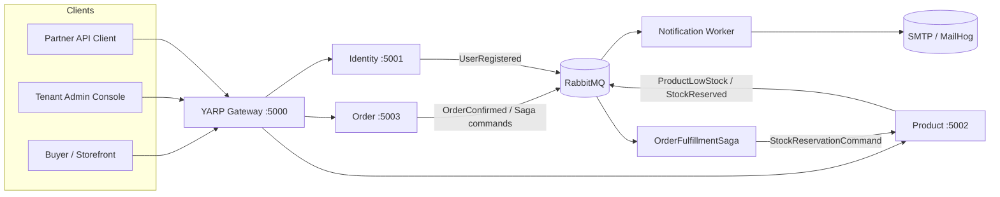
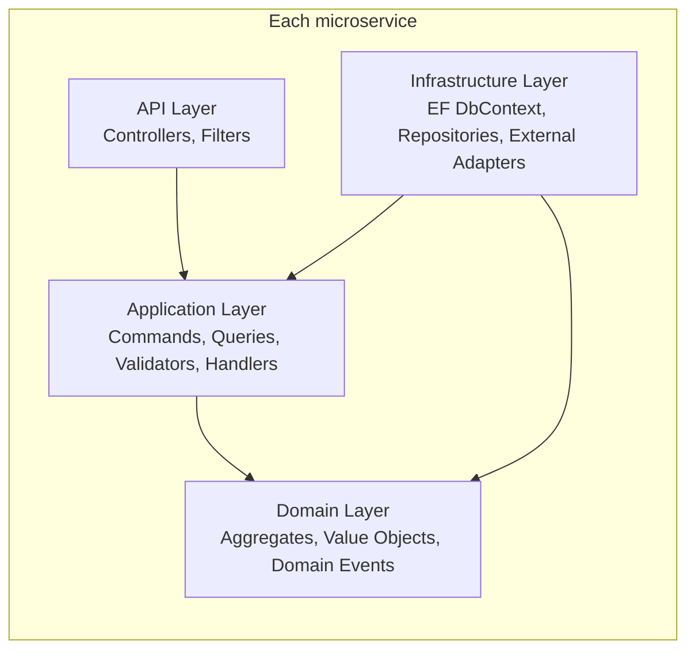
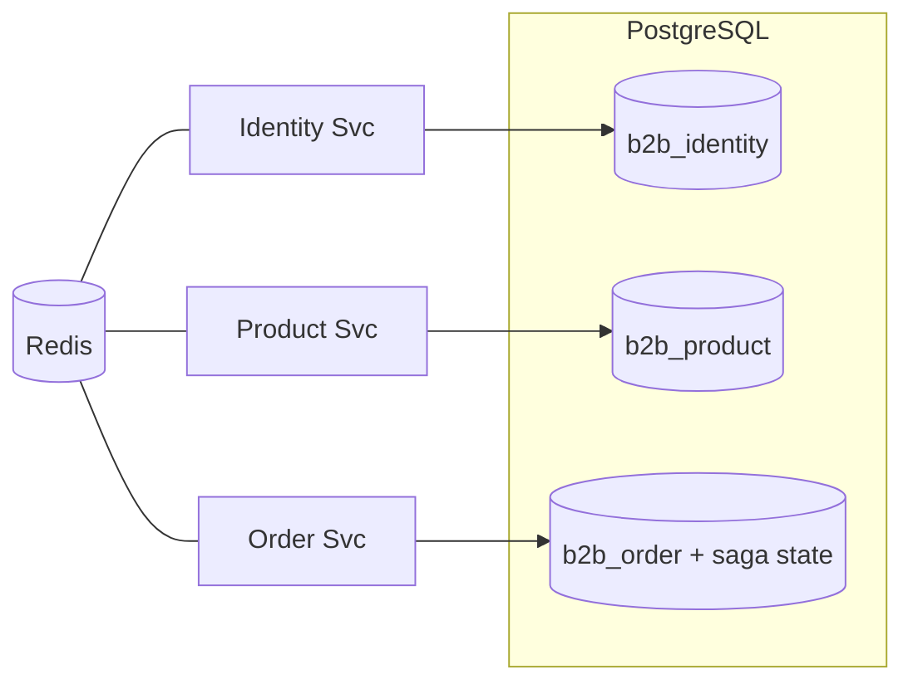
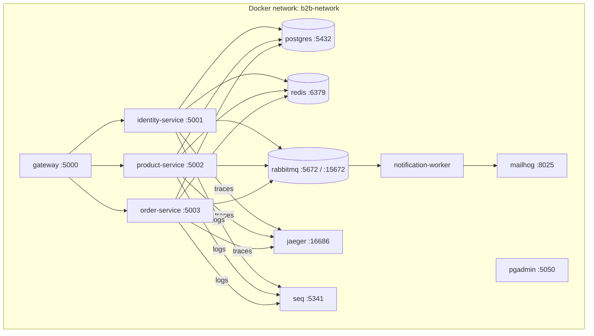

# High-Level Design — B2B Microservice Platform

| Field | Value |
|---|---|
| Document type | High-Level Design (HLD) |
| Companion docs | [BRD](BRD.md), [LLD](LLD.md) |
| Last revised | 2026-04-28 |

---

## 1. Architectural Style

- **Microservices** with bounded contexts: Identity, Product, Order, Notification.
- **API Gateway** (YARP) as the single public ingress with per-IP rate limiting.
- **Database-per-service** (PostgreSQL): `b2b_identity`, `b2b_product`, `b2b_order`. Services do not share schemas.
- **Asynchronous integration** via RabbitMQ + MassTransit for cross-service events.
- **Clean Architecture** within each service: Domain ← Application ← Infrastructure ← API.
- **CQRS** via MediatR 12 with a full pipeline of 8 behaviors (in registration order):
  `Logging → Retry → Idempotency → Performance → Authorization → Validation → Audit → DomainEvent → Handler`
- **Multi-tenant** by `TenantId` row scoping; resolved from JWT claims on every request.
- **Saga** — `OrderFulfillmentSaga` (MassTransit state machine) orchestrates stock reservation, payment, and shipment with compensating rollback.

## 2. Context Diagram

## 3. Service Catalogue

| Service | Port | Database | Purpose |
|---|---|---|---|
| Gateway | 5000 | — | Routing, JWT validation, rate limiting, health |
| Identity | 5001 | `b2b_identity` | Tenants, users, auth, JWT issuance |
| Product | 5002 | `b2b_product` | Catalog, categories, stock, stock reservation |
| Order | 5003 | `b2b_order` | Orders, lifecycle, totals, fulfillment saga |
| Notification Worker | — | — | Consumes integration events, sends email (9 consumer types) |

## 4. Logical Architecture (per service)

Dependency rule: arrows always point inward. The Domain layer has zero outward dependencies; Infrastructure provides the implementations of Application's port interfaces.

## 5. Cross-Cutting Concerns

| Concern | Mechanism | Owner module |
|---|---|---|
| Authentication | JWT bearer, validated at the gateway and re-validated at each service | `B2B.Shared.Infrastructure.Extensions.AddJwtAuthentication` |
| Authorization | Role claims on JWT + `AuthorizationBehavior` pipeline resolving `IAuthorizer<TRequest>` implementations via DI; `[Authorize]` attributes per controller | `AuthorizationBehavior` + `IAuthorizer<>` per command |
| Multi-tenancy | `ICurrentUser.TenantId` injected from JWT; manual `Where(x => x.TenantId == ...)` filter on every query | `CurrentUserService` + handlers |
| Validation | FluentValidation auto-discovered per assembly; runs in `ValidationBehavior` pipeline | `ValidationBehavior` |
| Idempotency | Marker interface `IIdempotentCommand` + Redis-backed `IdempotencyBehavior` | `IdempotencyBehavior` |
| Retry | Transient failure retry with exponential back-off in `RetryBehavior`; configurable via `RetryBehaviorOptions` (`IOptions<>`) | `RetryBehavior` |
| Performance | Warning logged when handler exceeds threshold in `PerformanceBehavior` | `PerformanceBehavior` |
| Audit | Command metadata written to audit log in `AuditBehavior` | `AuditBehavior` |
| Logging | Serilog → Console + Seq, request-name + elapsed ms in `LoggingBehavior` | Serilog + `LoggingBehavior` |
| Tracing | OpenTelemetry → OTLP → Jaeger; ASP.NET + HttpClient instrumented | `AddOpenTelemetry` extension |
| Health | `/health` endpoint per service; Postgres + Redis probes; gateway active health checks every 10s | `AddDefaultHealthChecks` + YARP config |
| Caching | Redis distributed cache via `ICacheService` (cache-aside pattern) | `RedisCacheService` |
| Messaging | MassTransit + RabbitMQ; in-memory outbox per consumer | `MassTransitEventBus` |
| Rate limiting | Per-IP fixed window + sliding window policies at the gateway | `AddRateLimiter` in Gateway |

## 6. Communication Patterns

| Direction | Pattern | Channel |
|---|---|---|
| Client → Gateway | Sync HTTP/JSON | YARP, port 5000 |
| Gateway → Service | Sync HTTP/JSON | Service container DNS, port 8080 |
| Service → Service (data) | **Not allowed.** Services do not call each other directly | — |
| Service → Service (events) | Async pub/sub | RabbitMQ exchanges, MassTransit consumers |
| Order Saga → Product | Async command (StockReservationCommand) | RabbitMQ |
| Service → Worker | Async pub/sub | Same RabbitMQ |

The "no direct service-to-service calls" rule enforces autonomy and avoids latency stacking. Cross-service workflows are orchestrated through the saga.

## 7. Data Architecture

- Each service migrates and owns its own schema.
- Saga state (`OrderFulfillmentSagaState`) persists in `b2b_order` via EF Core, enabling saga resumption after a crash.
- No FKs cross databases; cross-aggregate references are by ID only.
- Read replicas may be added per service when query volume warrants.
- Redis is shared as a *cache*, not a system of record — keys are namespaced per service (e.g. `products:tenant:{id}:page:{n}`, `idem:{commandType}:{key}`).

## 8. Tech Stack

| Layer | Choice |
|---|---|
| Runtime | .NET 9, C# 13 |
| Web | ASP.NET Core 9 |
| ORM | EF Core 9 (Npgsql provider) |
| Mediator | MediatR 12 |
| Validation | FluentValidation 11 |
| Mapping | Mapster 7 |
| Reverse proxy | YARP 2.2 |
| Auth | JWT Bearer + BCrypt password hashing |
| Cache | Redis 7 + StackExchange.Redis |
| Messaging | RabbitMQ 3 + MassTransit 8.3 (including Saga state machine) |
| Logging | Serilog → Seq |
| Tracing | OpenTelemetry → Jaeger |
| Resilience | Polly 8 + Microsoft.Extensions.Http.Resilience |
| Container | Docker, docker-compose for local |
| Tests | xUnit, FluentAssertions, NSubstitute, Bogus, Testcontainers |

## 9. Deployment Topology (local)

Production topology mirrors this but substitutes managed PG, managed Redis, and managed RabbitMQ (e.g. CloudAMQP). Each service runs as N replicas behind the gateway; the worker scales horizontally as competing consumers on the same queues.

## 10. Scaling Strategy

| Axis | Approach |
|---|---|
| Read traffic | Cache-aside on Redis; read replicas on PG when needed |
| Write throughput per service | Horizontal scale-out behind gateway; stateless API processes |
| Worker throughput | Multiple worker replicas as competing RabbitMQ consumers; per-queue prefetch tuned per consumer |
| Saga concurrency | Optimistic concurrency (`ConcurrencyMode.Optimistic`) on saga state rows; EF retry on conflict |
| Hot tenant | (Roadmap) per-tenant rate limit at gateway + per-tenant Npgsql pool cap |
| DB connections | (Roadmap) PgBouncer transaction-pool fronting PG when replica count grows |
| Event throughput | One queue per integration event; consistent-hash partition key for per-key ordering (roadmap) |

## 11. Security Architecture

- **Edge auth.** Gateway validates JWT signature, issuer, audience, lifetime.
- **Defence-in-depth.** Each service re-validates the JWT against the same secret.
- **Pipeline auth.** `AuthorizationBehavior` enforces role-based access at the command/query level before handlers execute.
- **Password storage.** BCrypt with cost factor as configured in `BcryptPasswordHasher`.
- **Secrets.** All credentials are environment variables; defaults shipped only for the local docker-compose stack.
- **Tenant isolation.** Every query filters by `ICurrentUser.TenantId`. Code review checklist enforces this.
- **Transport.** TLS terminated at the gateway in production. Inside the cluster, plain HTTP between gateway and services is acceptable when the network is private.
- **Refresh tokens.** Maximum 5 concurrent active tokens per user; oldest revoked when limit exceeded; all revoked on logout.

## 12. Observability

| Signal | Sink | Tool |
|---|---|---|
| Logs | Seq (`http://seq:5341`) | Structured JSON via Serilog |
| Traces | Jaeger (`http://jaeger:16686`) | OTLP exporter |
| Metrics | (planned) Prometheus/OTLP | OpenTelemetry metrics API |
| Health | `/health` per service | UIResponseWriter |

Every inbound request gets a W3C trace context that propagates through HTTP and RabbitMQ headers, so a single `traceId` covers Gateway → Order Service → RabbitMQ → Notification Worker → SMTP.

A `CorrelationIdMiddleware` at the gateway stamps every request with an `X-Correlation-ID` header that flows downstream through all services.

## 13. Reliability Patterns

| Pattern | Status | Detail |
|---|---|---|
| Message retry | ✅ Active | `cfg.UseMessageRetry(r => r.Intervals(100, 500, 1000, 2000, 5000))` |
| PG transient retry | ✅ Active | `npg.EnableRetryOnFailure(3)` per DbContext |
| In-memory outbox | ✅ Active | At-least-once within a single message handler scope |
| Idempotency cache | ✅ Active | 24h TTL on command pipeline |
| Health-check gating | ✅ Active | Gateway removes unhealthy nodes from routing |
| Saga compensating transactions | ✅ Active | Stock release, payment refund, or shipment cancel on any step failure |
| Saga timeouts | ✅ Active | RabbitMQ delayed message exchange; auto-cancels stalled orders |
| Persistent outbox (EF) | 🔲 Roadmap (P0) | Survives process crashes; replaces in-memory outbox |
| Optimistic concurrency on aggregates | 🔲 Roadmap (P0) | `xmin` column + `ConcurrencyBehavior` |

## 14. Roadmap (high-impact items)

| Priority | Item | Status | Rationale |
|---|---|---|---|
| P0 | Persistent outbox (EF + dispatcher) replacing in-memory outbox | 🔲 Pending | Crash safety for integration events |
| P0 | Optimistic concurrency on aggregates (`xmin`) + `ConcurrencyBehavior` | 🔲 Pending | Correct under concurrent writes |
| P1 | Per-tenant rate limiting at gateway | 🔲 Pending | Hot-tenant isolation |
| P1 | Cache stampede protection (single-flight) | 🔲 Pending | Hot-key correctness under load |
| P1 | Global EF query filter for `TenantId` | 🔲 Pending | Remove manual tenant scoping from handlers |
| P2 | MassTransit Saga for Order → Inventory → Payment workflow | ✅ Done | Long-running cross-service flow with compensation |
| P2 | PgBouncer in front of PG | 🔲 Pending | Connection-pool scaling |
| P3 | OpenTelemetry metrics → Prometheus | 🔲 Pending | Per-service RED metrics dashboard |

## 15. Architectural Decisions (key ADRs)

| # | Decision | Rationale |
|---|---|---|
| 1 | Database-per-service | Independent schema evolution; blast radius of a migration |
| 2 | Async-first cross-service contracts | Avoid latency stacking and tight coupling |
| 3 | Result pattern over exceptions for business errors | Errors are part of the contract; exceptions are for bugs |
| 4 | MediatR pipeline behaviors over middleware for domain concerns | Keeps cross-cutting code at the right abstraction layer |
| 5 | YARP rather than Ocelot or NGINX | First-party .NET, easy to extend with C# |
| 6 | MassTransit + RabbitMQ rather than a single broker abstraction | Mature .NET ergonomics and Saga support |
| 7 | MassTransit Saga (orchestration) over choreography for fulfillment | Explicit state machine gives full visibility into long-running flows; compensating logic stays in one place |
| 8 | Integration event contracts in `B2B.Shared.Core` | Single canonical source shared by all publishers and consumers; avoids coupling consumers to publisher assemblies |
