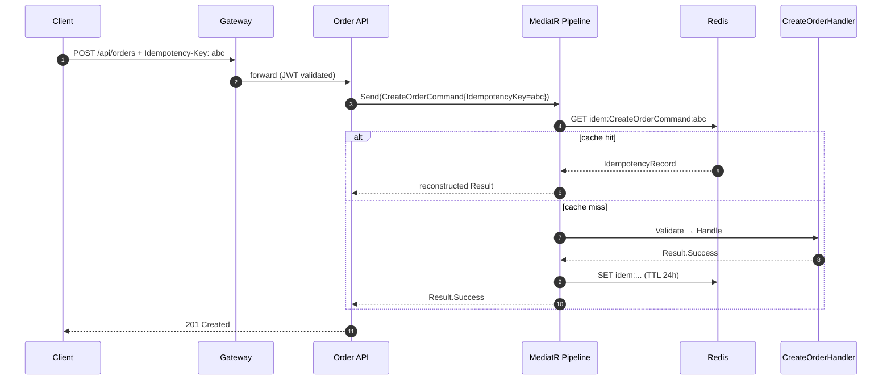
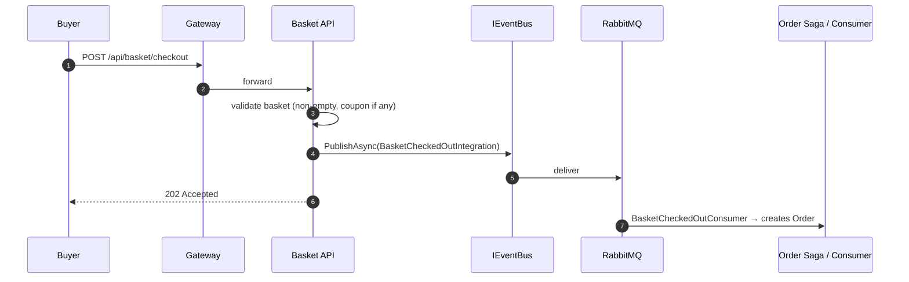

# Low-Level Design — B2B Microservice Platform

| Field | Value |
|---|---|
| Document type | Low-Level Design (LLD) |
| Audience | Backend engineers extending or maintaining the platform |
| Companion docs | [HLD](HLD.md), [BRD](BRD.md) |
| Last revised | 2026-04-30 |

This document is the engineer-level companion to the HLD. Where the HLD says *what* and *why*, this document says *how*, with concrete file paths and code shapes.

---

## 1. Solution Layout

```
src/
  Gateway/B2B.Gateway/                       # YARP reverse proxy
  Shared/
    B2B.Shared.Core/                         # Abstractions (no infra deps)
      CQRS/                                   ICommand, IQuery, IIdempotentCommand
      Common/                                 Result, Error, PagedList
      Domain/                                 Entity, AggregateRoot, ValueObject, IDomainEvent
      Interfaces/                             IRepository, IUnitOfWork, ICacheService,
                                              IEventBus, ICurrentUser, IPasswordHasher,
                                              IAuditableEntity, IReadRepository
    B2B.Shared.Infrastructure/               # Concrete adapters
      Behaviors/                              Logging, Retry, Idempotency, Performance,
                                              Authorization, Validation, Audit, DomainEvent
      Caching/RedisCacheService.cs
      Http/CurrentUserService.cs
      Messaging/MassTransitEventBus.cs
      Persistence/{BaseDbContext, BaseRepository}
      Security/BcryptPasswordHasher.cs
      Extensions/ServiceCollectionExtensions.cs
  Services/
    Identity/{Domain,Application,Infrastructure,Api}
    Product/{Domain,Application,Infrastructure,Api}
    Order/{Domain,Application,Infrastructure,Api}
    Basket/{Domain,Application,Infrastructure,Api}    # Redis-backed only
    Payment/{Domain,Application,Infrastructure,Api}
    Shipping/{Domain,Application,Infrastructure,Api}
    Vendor/{Domain,Application,Infrastructure,Api}
    Discount/{Domain,Application,Infrastructure,Api}
    Review/{Domain,Application,Infrastructure,Api}
  Workers/
    B2B.Notification.Worker/{Consumers,Contracts,Services}
tests/
  B2B.Identity.Tests/
  B2B.Product.Tests/
  B2B.Order.Tests/
  B2B.Shared.Tests/
  B2B.Basket.Tests/
  B2B.Payment.Tests/
  B2B.Shipping.Tests/
  B2B.Discount.Tests/
  B2B.Review.Tests/
  B2B.Vendor.Tests/
infrastructure/
  postgres/init.sql
```

Per-service standard subfolders:

```
{Service}.Domain/         Entities/  ValueObjects/  Events/
{Service}.Application/    Commands/  Queries/  Interfaces/
{Service}.Infrastructure/ Persistence/{Repositories,Configurations}/  Services/
{Service}.Api/            Controllers/
```

## 2. Building Blocks (`B2B.Shared.Core`)

### 2.1 Result & Error

`Result` and `Result<T>` carry success state plus a typed `Error` record. Business failures never throw; handlers return `Error.Validation(...)`, `Error.NotFound(...)`, `Error.Conflict(...)`, etc. The controller's `Problem(Error)` helper maps `ErrorType` to HTTP:

| ErrorType | HTTP |
|---|---|
| NotFound | 404 |
| Validation | 400 |
| Conflict | 409 |
| Unauthorized | 401 |
| Forbidden | 403 |
| Failure | 500 |

### 2.2 Entity, AggregateRoot, ValueObject

```csharp
public abstract class Entity<TId> : IEquatable<Entity<TId>> where TId : notnull
public abstract class AggregateRoot<TId> : Entity<TId>     // holds DomainEvents
public abstract class ValueObject : IEquatable<ValueObject> // component-equality
```

Aggregates raise events via `RaiseDomainEvent(...)`. The events are drained and dispatched by `DomainEventBehavior` *after* `SaveChangesAsync` succeeds, so listeners see only committed state.

### 2.3 Domain Event

```csharp
public abstract record DomainEvent : IDomainEvent
{
    public Guid EventId   { get; } = Guid.NewGuid();
    public DateTime OccurredOn { get; } = DateTime.UtcNow;
}
```

In-process. Cross-service equivalents are *integration events* (see §6).

### 2.4 CQRS interfaces

```csharp
public interface ICommand            : IRequest<Result>;
public interface ICommand<TResponse> : IRequest<Result<TResponse>>;
public interface IQuery<TResponse>   : IRequest<Result<TResponse>>;
public interface IIdempotentCommand  { string IdempotencyKey { get; } }
```

### 2.5 Port interfaces

| Interface | Purpose |
|---|---|
| `IRepository<TEntity, TId>` | Generic CRUD (write side) |
| `IReadRepository<TEntity, TId>` | Generic read-only (`GetByIdAsync`) |
| `IUnitOfWork` | `SaveChangesAsync`, `ExecuteInTransactionAsync` |
| `ICacheService` | `GetAsync`, `SetAsync`, `RemoveAsync`, `RemoveByPrefixAsync`, `GetOrCreateAsync` |
| `IEventBus` | `PublishAsync<T>` (integration events) |
| `ICurrentUser` | `UserId`, `TenantId`, `TenantSlug`, `Roles`, `IsAuthenticated`, `IsInRole` |
| `IPasswordHasher` | `Hash`, `Verify` |
| `IAuditableEntity` | `CreatedAt`, `UpdatedAt` |

## 3. MediatR Pipeline

Registration order in `B2B.Shared.Infrastructure.Extensions.ServiceCollectionExtensions.AddMediatRWithBehaviors`:

```
Request
  → LoggingBehavior
    → RetryBehavior
      → IdempotencyBehavior       (only if TRequest : IIdempotentCommand)
        → PerformanceBehavior
          → AuthorizationBehavior
            → ValidationBehavior  (only if validators registered)
              → AuditBehavior
                → DomainEventBehavior
                  → Handler
                    → Response
```

### 3.1 LoggingBehavior
Logs `{RequestName}` + elapsed milliseconds at Information level around `next()`.

### 3.2 RetryBehavior
Retries the inner pipeline on transient failures with exponential back-off. Wraps the remainder of the pipeline so transient faults in any downstream behavior or handler are eligible for retry.

### 3.3 IdempotencyBehavior

| Property | Value |
|---|---|
| Cache key | `idem:{TRequest.FullName}:{IdempotencyKey}` |
| TTL | 24 hours |
| What is cached | Only successful results (failures stay retryable) |

### 3.4 PerformanceBehavior
Measures handler wall-clock time and logs a warning when the elapsed time exceeds a configured threshold.

### 3.5 AuthorizationBehavior
Enforces role-based access at the command/query level using the caller's JWT claims before handlers execute. Fails fast with `Result.Failure(Error.Forbidden(...))` when access is denied.

### 3.6 ValidationBehavior
Resolves `IEnumerable<IValidator<TRequest>>`, runs them, short-circuits with `Result.Failure(Error.Validation(...))` on the first error.

### 3.7 AuditBehavior
Writes command metadata (request type, caller identity, timestamp) to the audit log after authorization and validation pass.

### 3.8 DomainEventBehavior
After the handler returns, scans the EF `ChangeTracker` for `AggregateRoot<>` instances, drains their `DomainEvents` with `ClearDomainEvents()`, and `Publish`es each one through MediatR.

## 4. Per-Service Layering

### 4.1 Order (full example)

`Order : AggregateRoot<Guid>` state lifecycle:
```
Pending → Confirmed → Processing → Shipped → Delivered
       ↘                                   ↗
        Cancelled  (allowed before Delivered)
```

Type-alias convention:
```csharp
using OrderEntity     = B2B.Order.Domain.Entities.Order;
using OrderItemEntity = B2B.Order.Domain.Entities.OrderItem;
using OrderStatus     = B2B.Order.Domain.Entities.OrderStatus;
```

### 4.2 Basket (Redis-backed exception)

`Basket` is the only service without a PostgreSQL backing store. The Application layer defines:

```csharp
public interface IBasketRepository
{
    Task<Basket?> GetAsync(Guid userId, CancellationToken ct = default);
    Task SaveAsync(Basket basket, CancellationToken ct = default);
    Task DeleteAsync(Guid userId, CancellationToken ct = default);
}
```

The Infrastructure layer implements it using `StackExchange.Redis` (JSON hash per user). There is no `IUnitOfWork` involved — `SaveAsync` writes directly to Redis.

### 4.3 Vendor (type alias)

```csharp
using VendorEntity = B2B.Vendor.Domain.Entities.Vendor;
using VendorStatus = B2B.Vendor.Domain.Entities.VendorStatus;
```

Applies to all files under `B2B.Vendor.*`. The `Vendor` name is both the namespace root and the aggregate class — without the alias the compiler raises `CS0118`.

### 4.4 Typical service state machines

| Service | Aggregate | States |
|---|---|---|
| Order | `Order` | Pending → Confirmed → Processing → Shipped → Delivered / Cancelled |
| Payment | `Payment` | Pending → Completed / Failed / Refunded |
| Shipment | `Shipment` | Pending → Shipped → Delivered / Cancelled |
| Vendor | `Vendor` | PendingApproval → Active → Suspended → Active / Deactivated |
| Review | `Review` | Pending → Approved / Rejected |
| Discount | `Discount` | Active → Inactive |

## 5. Persistence Conventions

| Concern | Convention |
|---|---|
| PK | `Guid` generated client-side in the static factory (`Guid.NewGuid()`) |
| Tenant scoping | Every aggregate carries `TenantId`; every query filters on it |
| Soft delete | Not currently implemented |
| Auditing | `IAuditableEntity { CreatedAt, UpdatedAt }` — set by domain factories |
| Migrations | Per-service EF migrations under `Persistence/Migrations/` |
| Connection | Npgsql with `EnableRetryOnFailure(3)`, command timeout 30s |

## 6. Caching

`ICacheService` (Redis-backed in production, swappable for tests) implements cache-aside:

```csharp
var products = await cache.GetOrCreateAsync(
    key:     $"products:tenant:{tenantId}:page:{page}",
    factory: async () => await productRepository.GetPagedAsync(...),
    expiry:  TimeSpan.FromMinutes(5));

// invalidation on mutation
await cache.RemoveByPrefixAsync($"products:tenant:{tenantId}");
```

`RedisCacheService` swallows transient cache failures (logs a warning and falls through to the factory) so cache outages degrade gracefully into direct DB hits.

## 7. Messaging

### 7.1 Domain events vs integration events

| | Domain Event | Integration Event |
|---|---|---|
| Scope | Inside one service | Across services |
| Transport | MediatR `INotification` | RabbitMQ via MassTransit |
| Example | `OrderConfirmedEvent` | `OrderConfirmedIntegration` |

### 7.2 Integration event contracts

All integration event contracts are defined in `B2B.Shared.Core/Messaging/IntegrationEvents.cs`:

```csharp
public sealed record OrderConfirmedIntegration(Guid OrderId, string OrderNumber, Guid CustomerId, ...);
public sealed record StockReservedIntegration(Guid OrderId, ...);
public sealed record PaymentProcessedIntegration(Guid OrderId, Guid PaymentId, decimal Amount, ...);
public sealed record ShipmentCreatedIntegration(Guid OrderId, Guid ShipmentId, string TrackingNumber, ...);
public sealed record BasketCheckedOutIntegration(Guid UserId, Guid TenantId, List<BasketItemDto> Items, ...);
public sealed record UserRegisteredIntegration(Guid UserId, string Email, ...);
public sealed record ProductLowStockIntegration(Guid ProductId, string Sku, int CurrentStock, ...);
```

### 7.3 OrderFulfillmentSaga

`OrderFulfillmentSaga` is a MassTransit state machine orchestrating the full fulfillment flow.

**States**

| State | Meaning |
|---|---|
| `Initial` | Awaiting `OrderConfirmedIntegration` |
| `AwaitingStockReservation` | `ReserveStockCommand` published |
| `AwaitingPayment` | `ProcessPaymentCommand` published |
| `AwaitingShipment` | `CreateShipmentCommand` published |
| `Final` | Fulfilled or cancelled |

**Compensating chains**

| Failure | Compensation |
|---|---|
| `StockReservationFailed` / timeout | `OrderCancelledDueToStockIntegration` → Final |
| `PaymentFailed` / timeout | `ReleaseStockCommand` → `OrderCancelledDueToPaymentIntegration` → Final |
| `ShipmentFailed` / timeout | `RefundPaymentCommand` + `ReleaseStockCommand` → `OrderCancelledDueToShipmentIntegration` → Final |

**Default saga timeouts** (configurable via `OrderFulfillmentSagaOptions`):

| Step | Default |
|---|---|
| Stock reservation | 5 minutes |
| Payment | 10 minutes |
| Shipment | 2 hours |

### 7.4 MassTransit configuration

`AddEventBus(...)` extension wires:
```csharp
cfg.UseMessageRetry(r => r.Intervals(100, 500, 1000, 2000, 5000));
cfg.UseInMemoryOutbox(ctx);
cfg.ConfigureEndpoints(ctx);
```

## 8. Identity & Authentication

- Login: `POST /api/identity/auth/login` → `{ accessToken, refreshToken }`.
- Access token: JWT HS256, 60 min TTL, claims `sub`/`email`/`tenant_id`/`tenant_slug`/`role`.
- Passwords: BCrypt via `IPasswordHasher` (port) and `BcryptPasswordHasher` (adapter).
- JWT validation runs both at the gateway *and* at every service.

## 9. Idempotency End-to-End



## 10. Basket Checkout Flow



## 11. Adding a New Command (recipe)

1. `Application/Commands/{Name}/{Name}Command.cs` implementing `ICommand<TResponse>` (+ `IIdempotentCommand` if money-affecting).
2. `{Name}Handler.cs` implementing `ICommandHandler<{Name}Command, TResponse>`. Inject only the ports needed.
3. (Optional) `{Name}Validator.cs : AbstractValidator<{Name}Command>` — auto-discovered.
4. (If resource-based access control) `{Name}Authorizer.cs : IAuthorizer<{Name}Command>`, registered in DI.
5. Controller method: construct command → `ISender.Send` → map `Result` → `IActionResult`.
6. Tests: `{Name}HandlerTests.cs` + `{Name}AuthorizerTests.cs` (if applicable).

## 12. Adding a New Microservice (recipe)

1. Create four projects: `{Svc}.Domain`, `{Svc}.Application`, `{Svc}.Infrastructure`, `{Svc}.Api`.
2. Reference policy: Domain → only `B2B.Shared.Core`; Application → Domain + Core; Infrastructure → Application + Shared.Infrastructure; Api → Infrastructure.
3. Add standard subfolders.
4. Add type alias if service name collides (e.g. `Vendor`, `Order`, `Product`).
5. Wire DI:
   ```csharp
   builder.Services.AddSharedInfrastructure(config, "B2B.{Svc}", new[] { typeof({Svc}AssemblyMarker).Assembly });
   builder.Services.Add{Svc}Infrastructure(config);
   builder.Services.AddEventBus(config, x => { /* consumers */ });
   ```
6. Add YARP route + cluster + health check to `B2B.Gateway/appsettings.json`.
7. Add service to `docker-compose.yml` + env to `docker-compose.override.yml`.
8. Add `CREATE DATABASE b2b_{svc};` to `infrastructure/postgres/init.sql`.
9. Add test project under `tests/` and register in `B2B.sln`.

## 13. Testing Conventions

| Layer | Tooling | What to test |
|---|---|---|
| Domain | xUnit + FluentAssertions | Aggregate invariants, state transitions, value-object equality, factory enforcement |
| Application handlers | xUnit + NSubstitute + Bogus | Handler logic with mocked ports; Result types for both success and each error branch |
| Application authorizers | xUnit + NSubstitute | All authorized paths (by role, by ownership), plus the denied path |
| Application validators | xUnit + FluentValidation.TestHelper | Field-level rules, boundary values |
| Infrastructure | xUnit + Testcontainers PG/Redis/RabbitMQ | Real EF queries, real MassTransit consumers |
| API | (planned) `WebApplicationFactory<T>` | Auth, routing, status code mapping |

### Current test counts

| Project | Tests | Breakdown |
|---|---|---|
| `B2B.Identity.Tests` | 135 | Domain (3 files), Application handlers (10 files), Validators (2 files), Infrastructure (1 file) |
| `B2B.Product.Tests` | 55 | Domain (3 files), Application handlers (8 files) |
| `B2B.Order.Tests` | 69 | Domain (3 files), Application handlers (7 files), Authorizers (1 file) |
| `B2B.Shared.Tests` | 12 | Pipeline behaviors (3 files): Validation, Authorization, Idempotency |
| `B2B.Basket.Tests` | 52 | Domain (2 files), Application handlers (6 files), Validators (1 file) |
| `B2B.Payment.Tests` | 70 | Domain (2 files), Application handlers (9 files), Validators (2 files) |
| `B2B.Shipping.Tests` | 23 | Domain (1 file), Application handlers (3 files) |
| `B2B.Discount.Tests` | 76 | Domain (2 files), Application handlers (7 files), Validators (2 files) |
| `B2B.Review.Tests` | 35 | Domain (1 file), Application handlers (6 files), Validators (1 file) |
| `B2B.Vendor.Tests` | 59 | Domain (1 file), Application handlers (7 files), Validators (1 file) |
| **Total** | **586** | **All green** |

### Handler test pattern

```csharp
public sealed class CancelOrderHandlerTests
{
    private readonly IOrderRepository _orderRepo = Substitute.For<IOrderRepository>();
    private readonly IUnitOfWork _uow            = Substitute.For<IUnitOfWork>();
    private readonly ICurrentUser _currentUser   = Substitute.For<ICurrentUser>();
    private readonly CancelOrderHandler _handler;

    public CancelOrderHandlerTests()
    {
        _currentUser.TenantId.Returns(_tenantId);
        _handler = new CancelOrderHandler(_orderRepo, _uow, _currentUser);
    }

    [Fact]
    public async Task Handle_WhenOrderNotFound_ShouldReturnNotFound() { ... }
}
```

### Validator test pattern (FluentValidation.TestHelper)

```csharp
public sealed class RegisterVendorValidatorTests
{
    private readonly RegisterVendorValidator _validator = new();

    [Fact]
    public void Validate_Valid_ShouldPass()
    {
        _validator.TestValidate(Valid()).ShouldNotHaveAnyValidationErrors();
    }

    [Fact]
    public void Validate_EmptyCompanyName_ShouldFail()
    {
        _validator.TestValidate(Valid() with { CompanyName = "" })
            .ShouldHaveValidationErrorFor(x => x.CompanyName);
    }
}
```

## 14. Observability Specifics

- Every `Program.cs` calls `AddOpenTelemetry(config, "B2B.{Svc}")`. Service name flows into Jaeger as `service.name`.
- `LoggingBehavior` emits `Handled {Request} in {Elapsed}ms`.
- Health endpoint at `/health` returns the standard `UIResponseWriter` JSON.

## 15. Configuration & Secrets

Configuration precedence:
1. Environment variables (`__` separator)
2. `appsettings.{Environment}.json`
3. `appsettings.json`

Local-dev defaults live in `docker-compose.override.yml`. Production secrets are injected by the orchestrator — **never committed**.

### Notable `IOptions<>` sections

| Class | Section key |
|---|---|
| `RetryBehaviorOptions` | `"RetryBehavior"` |
| `OrderFulfillmentSagaOptions` | `"OrderFulfillmentSaga"` |

## 16. Known Limitations

| Limitation | Tracked in |
|---|---|
| In-memory MassTransit outbox loses messages on crash | HLD §13 (P0) |
| No optimistic concurrency token on aggregates | HLD §13 (P0) |
| No per-tenant rate limiting | HLD §14 (P1) |
| No global query filter for `TenantId` (manual today) | §5 |
| Auditing fields set by hand in factories rather than an interceptor | §5 |
| Basket is ephemeral — lost on Redis restart | By design (BRD FR-BS-7) |
