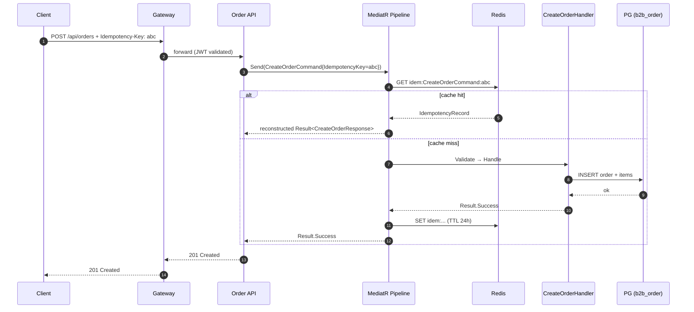
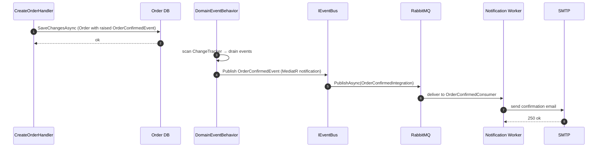

# Low-Level Design — B2B Microservice Platform

| Field | Value |
|---|---|
| Document type | Low-Level Design (LLD) |
| Audience | Backend engineers extending or maintaining the platform |
| Companion docs | [HLD](HLD.md), [BRD](BRD.md) |
| Last revised | 2026-04-28 |

This document is the engineer-level companion to the HLD. Where the HLD says *what* and *why*, this document says *how*, with concrete file paths and code shapes.

---

## 1. Solution Layout

```
src/
  Gateway/B2B.Gateway/                       # YARP reverse proxy
  Shared/
    B2B.Shared.Core/                         # Abstractions (no infra deps)
      CQRS/                                   ICommand, IQuery, IIdempotentCommand
      Common/                                 Result, Error, PagedList
      Domain/                                 Entity, AggregateRoot, ValueObject, IDomainEvent
      Interfaces/                             IRepository, IUnitOfWork, ICacheService,
                                              IEventBus, ICurrentUser, IPasswordHasher,
                                              IAuditableEntity
    B2B.Shared.Infrastructure/               # Concrete adapters
      Behaviors/                              Logging, Retry, Idempotency, Performance,
                                              Authorization, Validation, Audit, DomainEvent
      Caching/RedisCacheService.cs
      Http/CurrentUserService.cs
      Messaging/MassTransitEventBus.cs
      Persistence/{BaseDbContext, BaseRepository}
      Security/BcryptPasswordHasher.cs
      Extensions/ServiceCollectionExtensions.cs
  Services/
    Identity/{Domain,Application,Infrastructure,Api}
    Product/{Domain,Application,Infrastructure,Api}
    Order/{Domain,Application,Infrastructure,Api}
  Workers/
    B2B.Notification.Worker/{Consumers,Contracts,Services}
tests/
  B2B.Identity.Tests/
  B2B.Product.Tests/
  B2B.Order.Tests/
  B2B.Shared.Tests/
infrastructure/
  postgres/init.sql
```

Per-service standard subfolders:

```
{Service}.Domain/         Entities/  ValueObjects/  Events/
{Service}.Application/    Commands/  Queries/  Interfaces/
{Service}.Infrastructure/ Persistence/{Repositories,Configurations}/  Services/
{Service}.Api/            Controllers/
```

## 2. Building Blocks (`B2B.Shared.Core`)

### 2.1 Result & Error

`Result` and `Result<T>` carry success state plus a typed `Error` record. Business failures never throw; handlers return `Error.Validation(...)`, `Error.NotFound(...)`, `Error.Conflict(...)`, etc. The controller's `Problem(Error)` helper maps `ErrorType` to HTTP:

| ErrorType | HTTP |
|---|---|
| NotFound | 404 |
| Validation | 400 |
| Conflict | 409 |
| Unauthorized | 401 |
| Forbidden | 403 |
| Failure | 500 |

### 2.2 Entity, AggregateRoot, ValueObject

```csharp
public abstract class Entity<TId> : IEquatable<Entity<TId>> where TId : notnull
public abstract class AggregateRoot<TId> : Entity<TId>     // holds DomainEvents
public abstract class ValueObject : IEquatable<ValueObject> // component-equality
```

Aggregates raise events via `RaiseDomainEvent(...)`. The events are drained and dispatched by `DomainEventBehavior` *after* `SaveChangesAsync` succeeds, so listeners see only committed state.

### 2.3 Domain Event

```csharp
public abstract record DomainEvent : IDomainEvent
{
    public Guid EventId   { get; } = Guid.NewGuid();
    public DateTime OccurredOn { get; } = DateTime.UtcNow;
}
```

In-process. Cross-service equivalents are *integration events* (see §6).

### 2.4 CQRS interfaces

```csharp
public interface ICommand            : IRequest<Result>;
public interface ICommand<TResponse> : IRequest<Result<TResponse>>;
public interface IQuery<TResponse>   : IRequest<Result<TResponse>>;
public interface IIdempotentCommand  { string IdempotencyKey { get; } }
```

### 2.5 Port interfaces

| Interface | Purpose |
|---|---|
| `IRepository<TEntity, TId>` | Generic CRUD |
| `IUnitOfWork` | `SaveChangesAsync`, `ExecuteInTransactionAsync` |
| `ICacheService` | `GetAsync`, `SetAsync`, `RemoveAsync`, `RemoveByPrefixAsync`, `GetOrCreateAsync` |
| `IEventBus` | `PublishAsync<T>` (integration events) |
| `ICurrentUser` | `UserId`, `TenantId`, `TenantSlug`, `Roles`, `IsAuthenticated`, `IsInRole` |
| `IPasswordHasher` | `Hash`, `Verify` |
| `IAuditableEntity` | `CreatedAt`, `UpdatedAt` |

## 3. MediatR Pipeline

Registration order in `B2B.Shared.Infrastructure.Extensions.ServiceCollectionExtensions.AddMediatRWithBehaviors`:

```
Request
  → LoggingBehavior
    → RetryBehavior
      → IdempotencyBehavior       (only if TRequest : IIdempotentCommand)
        → PerformanceBehavior
          → AuthorizationBehavior
            → ValidationBehavior  (only if validators registered)
              → AuditBehavior
                → DomainEventBehavior
                  → Handler
                    → Response
```

```csharp
cfg.AddOpenBehavior(typeof(LoggingBehavior<,>));
cfg.AddOpenBehavior(typeof(RetryBehavior<,>));
cfg.AddOpenBehavior(typeof(IdempotencyBehavior<,>));
cfg.AddOpenBehavior(typeof(PerformanceBehavior<,>));
cfg.AddOpenBehavior(typeof(AuthorizationBehavior<,>));
cfg.AddOpenBehavior(typeof(ValidationBehavior<,>));
cfg.AddOpenBehavior(typeof(AuditBehavior<,>));
cfg.AddOpenBehavior(typeof(DomainEventBehavior<,>));
```

### 3.1 LoggingBehavior

Logs `{RequestName}` + elapsed milliseconds at Information level around `next()`.

### 3.2 RetryBehavior

Retries the inner pipeline on transient failures with exponential back-off. Wraps the remainder of the pipeline so transient faults in any downstream behavior or handler are eligible for retry.

### 3.3 IdempotencyBehavior

| Property | Value |
|---|---|
| Cache key | `idem:{TRequest.FullName}:{IdempotencyKey}` |
| TTL | 24 hours |
| What is cached | Only successful results (failures stay retryable) |
| Storage shape | `IdempotencyRecord(IsSuccess, Error, JsonElement? Value)` |
| Reconstruction | Reflection over `Result.Success<T>` / `Result.Failure<T>` factories |

```csharp
public sealed class IdempotencyBehavior<TRequest, TResponse> : IPipelineBehavior<TRequest, TResponse>
    where TRequest  : notnull, IIdempotentCommand
    where TResponse : Result
```

The generic constraint makes the behavior compile-time-skippable for non-idempotent commands; queries and unmarked commands incur zero overhead.

### 3.4 PerformanceBehavior

Measures handler wall-clock time and logs a warning when the elapsed time exceeds a configured threshold, enabling slow-handler detection without instrumentation overhead in the fast path.

### 3.5 AuthorizationBehavior

Enforces role-based access at the command/query level using the caller's JWT claims (`ICurrentUser.Roles`) before handlers execute. Fails fast with `Result.Failure(Error.Forbidden(...))` when access is denied.

### 3.6 ValidationBehavior

Resolves `IEnumerable<IValidator<TRequest>>`, runs them, short-circuits with `Result.Failure(Error.Validation(...))` on the first error. Reflection synthesises the right `Result<T>` shape via the static `Result.Failure<T>` factory.

### 3.7 AuditBehavior

Writes command metadata (request type, caller identity, timestamp) to the audit log after authorization and validation pass, providing a traceable record of every intent that reached the handler layer.

### 3.8 DomainEventBehavior

After the handler returns, scans the EF `ChangeTracker` for `AggregateRoot<>` instances, drains their `DomainEvents` with `ClearDomainEvents()`, and `Publish`es each one through MediatR. Listeners are normal `INotificationHandler<TEvent>` implementations and may emit *integration events* via `IEventBus`.

## 4. Per-Service Layering (Order example)

### 4.1 Domain — `B2B.Order.Domain`

`Order : AggregateRoot<Guid>, IAuditableEntity` is the consistency boundary. Construction is via static factory `Order.Create(customerId, tenantId, address, orderNumber, notes?, billingAddress?)`. State transitions enforce the lifecycle:

```
Pending → Confirmed → Processing → Shipped → Delivered
       ↘                                   ↗
        Cancelled  (allowed before Delivered)
```

Each transition validates the current status and raises a domain event:

| Method | Raises |
|---|---|
| `Confirm()` | `OrderConfirmedEvent` |
| `Ship(trackingNumber)` | `OrderShippedEvent` |
| `Deliver()` | `OrderDeliveredEvent` |
| `Cancel(reason)` | `OrderCancelledEvent` |

Totals are derived (`Subtotal = Σ TotalPrice`, `TaxAmount = Subtotal × TaxRate`, `TotalAmount = Subtotal + TaxAmount + ShippingCost`). `TaxRate` defaults to 0 and is set via `ApplyTaxRate(rate)` before confirmation; `ShippingCost` defaults to 0 and is set via `ApplyShippingCost(cost)`. Clients cannot set totals directly.

`OrderItem : Entity<Guid>` is a **non-root** entity — it is mutated only through `Order.AddItem`/`RemoveItem`. There is no `IOrderItemRepository`.

`Address : ValueObject` is constructed via `Address.Create(street, city, state, postalCode, country)`.

### 4.2 Application — `B2B.Order.Application`

```
Commands/CreateOrder/
  CreateOrderCommand.cs       implements ICommand<CreateOrderResponse>, IIdempotentCommand
  CreateOrderHandler.cs       ICommandHandler<CreateOrderCommand, CreateOrderResponse>
  CreateOrderValidator.cs     AbstractValidator<CreateOrderCommand>
Queries/GetOrders/
  GetOrdersQuery.cs           IQuery<PagedList<OrderSummaryDto>>
  GetOrdersHandler.cs
Interfaces/
  IOrderRepository.cs         extends IRepository<OrderEntity, Guid>
```

Type-alias convention because `Order` is both a namespace and an entity name:

```csharp
using OrderEntity = B2B.Order.Domain.Entities.Order;
using OrderItemEntity = B2B.Order.Domain.Entities.OrderItem;
using OrderStatus = B2B.Order.Domain.Entities.OrderStatus;
```

This rule applies to *every* file under `B2B.Order.*` (handlers, repositories, DbContext, tests). Same rule for `Product`.

### 4.3 Infrastructure — `B2B.Order.Infrastructure`

```
Persistence/
  OrderDbContext.cs           extends BaseDbContext
  Configurations/             IEntityTypeConfiguration<TEntity> classes (per-table mapping)
  Repositories/
    OrderRepository.cs        IOrderRepository implementation
Services/                     adapters for any service-specific port (none yet for Order)
DependencyInjection.cs        AddOrderInfrastructure(this IServiceCollection, IConfiguration)
```

Repositories extend `BaseRepository<TEntity, TId>` — provides `GetByIdAsync`, `AddAsync`, `Update`, `Remove`. Service-specific methods (e.g. `GetByCustomerAsync(customerId, tenantId, page, pageSize)`) are added on the concrete repo and surfaced through the `IOrderRepository` extension interface.

`BaseDbContext.SaveChangesAsync` is the unit-of-work entry point. It is invoked by handlers via `IUnitOfWork`. After successful save, `DomainEventBehavior` drains and publishes events.

### 4.4 API — `B2B.Order.Api`

```csharp
[ApiController, Route("api/orders"), Authorize]
public sealed class OrdersController(ISender sender) : ControllerBase
{
    [HttpPost]
    public async Task<IActionResult> Create(
        [FromBody] CreateOrderCommand command,
        [FromHeader(Name = "Idempotency-Key")] string? idempotencyKey,
        CancellationToken ct)
    {
        var withKey = command with { IdempotencyKey = idempotencyKey ?? string.Empty };
        var result = await sender.Send(withKey, ct);
        return result.IsSuccess
            ? CreatedAtAction(nameof(GetAll), new { result.Value.OrderId }, result.Value)
            : Problem(result.Error);
    }
    // …
}
```

Controllers are intentionally thin: header → command, send via `ISender`, map `Result` → `IActionResult`.

## 5. Persistence Conventions

| Concern | Convention |
|---|---|
| PK | `Guid` generated client-side in the static factory (`Guid.NewGuid()`) |
| Tenant scoping | Every aggregate carries `TenantId`; every query filters on it |
| Soft delete | Not currently implemented |
| Auditing | `IAuditableEntity { CreatedAt, UpdatedAt }` — currently set by domain factories; an interceptor is on the roadmap |
| Migrations | Per-service EF migrations under `Persistence/Migrations/` |
| Connection | Npgsql with `EnableRetryOnFailure(3)`, command timeout 30s |
| Connection string | `ConnectionStrings:DefaultConnection` per service |

## 6. Caching

`ICacheService` (Redis-backed in production, swappable for tests) implements cache-aside:

```csharp
var products = await cache.GetOrCreateAsync(
    key:     $"products:tenant:{tenantId}:page:{page}",
    factory: async () => await productRepository.GetPagedAsync(...),
    expiry:  TimeSpan.FromMinutes(5));

// invalidation on mutation
await cache.RemoveByPrefixAsync($"products:tenant:{tenantId}");
```

`RedisCacheService` swallows transient cache failures (logs a warning and falls through to the factory) so cache outages degrade gracefully into direct DB hits.

## 7. Messaging

### 7.1 Domain events vs integration events

| | Domain Event | Integration Event |
|---|---|---|
| Scope | Inside one service | Across services |
| Transport | MediatR `INotification` | RabbitMQ via MassTransit |
| Coupling | Tight (same process) | Loose (broker) |
| Example | `OrderConfirmedEvent` | `OrderConfirmedIntegration` |

The convention is: a domain event handler maps the domain event to one or more integration events and publishes via `IEventBus`.

### 7.2 Integration event contracts

All integration event contracts are defined in `B2B.Shared.Core/Messaging/IntegrationEvents.cs` — the single canonical source shared by every publisher and consumer:

```csharp
// Examples (full list in the file)
public sealed record OrderConfirmedIntegration(Guid OrderId, string OrderNumber, Guid CustomerId,
    string CustomerEmail, decimal TotalAmount, string TenantId, DateTime ConfirmedAt);
public sealed record StockReservedIntegration(Guid OrderId, ...);
public sealed record UserRegisteredIntegration(Guid UserId, string Email, ...);
public sealed record ProductLowStockIntegration(Guid ProductId, string Sku, int CurrentStock, ...);
```

`B2B.Notification.Worker/Contracts/IntegrationEvents.cs` mirrors a subset of these for local reference; the authoritative definitions are always in `B2B.Shared.Core`. Publishers (Order, Identity, Product services) and consumers (Notification Worker, `OrderFulfillmentSaga`) all reference `B2B.Shared.Core` directly, so contract types are never duplicated across assemblies.

### 7.3 OrderFulfillmentSaga

`OrderFulfillmentSaga` (`B2B.Order.Application/Sagas/`) is a MassTransit state machine that orchestrates the complete fulfillment workflow across three downstream services (Product, Payment, Shipping).

**States**

| State | Meaning |
|---|---|
| `Initial` | Awaiting the first `OrderConfirmedIntegration` message |
| `AwaitingStockReservation` | `ReserveStockCommand` published; waiting for product service reply |
| `AwaitingPayment` | `ProcessPaymentCommand` published; waiting for payment service reply |
| `AwaitingShipment` | `CreateShipmentCommand` published; waiting for shipping service reply |
| `Final` | Fulfilled or cancelled; row deleted from `b2b_order` via `SetCompletedWhenFinalized()` |

**Happy path**

```
OrderConfirmedIntegration
  → publish ReserveStockCommand       → AwaitingStockReservation
StockReservedIntegration
  → publish ProcessPaymentCommand     → AwaitingPayment
PaymentProcessedIntegration
  → publish CreateShipmentCommand     → AwaitingShipment
ShipmentCreatedIntegration
  → publish OrderFulfilledIntegration → Final
```

**Compensating transaction chains**

| Failure | Compensation |
|---|---|
| `StockReservationFailed` / stock timeout | Publish `OrderCancelledDueToStockIntegration` → Final (no compensation needed; stock was never reserved) |
| `PaymentFailed` / payment timeout | Publish `ReleaseStockCommand` → `OrderCancelledDueToPaymentIntegration` → Final |
| `ShipmentFailed` / shipment timeout | Publish `RefundPaymentCommand` + `ReleaseStockCommand` → `OrderCancelledDueToShipmentIntegration` → Final |

**Timeout scheduling**

Timeouts are scheduled via MassTransit's `Schedule` API backed by the RabbitMQ delayed-message exchange (`rabbitmq_delayed_message_exchange` plugin). Default deadlines are configured in `OrderFulfillmentSagaOptions` (injected via `IOptions<>`):

| Step | Default deadline |
|---|---|
| Stock reservation | 5 minutes |
| Payment | 10 minutes |
| Shipment | 2 hours |

Timeout tokens (`StockTimeoutToken`, `PaymentTimeoutToken`, `ShipmentTimeoutToken`) are stored on the saga state so MassTransit can cancel a scheduled message when the expected reply arrives before the deadline.

**Correlation**

`CorrelationId == OrderId` for all messages. The HTTP `X-Correlation-ID` header is propagated transparently as a MassTransit header by `MassTransitEventBus`.

**Concurrency**

`ISagaVersion` + `ConcurrencyMode.Optimistic` on the EF Core saga state row. MassTransit increments `Version` on every transition and retries automatically on `DbUpdateConcurrencyException`.

**Saga state persistence**

`OrderFulfillmentSagaState` is persisted in the `b2b_order` PostgreSQL database via EF Core, configured in `OrderFulfillmentSagaStateMap`. State survives process restarts; in-flight sagas resume on the next message delivery.

### 7.4 MassTransit configuration

`AddEventBus(...)` extension wires:

```csharp
cfg.UseMessageRetry(r => r.Intervals(100, 500, 1000, 2000, 5000));
cfg.UseInMemoryOutbox(ctx);
cfg.ConfigureEndpoints(ctx);
```

The in-memory outbox guarantees at-least-once delivery within a single message handler scope. **It does not survive a process crash.** Migrating to MassTransit's EF outbox is a P0 item (HLD §14).

## 8. Identity & Authentication

- Login: `POST /api/identity/auth/login` returns `{ accessToken, refreshToken }`.
- Access token: JWT, HS256, 60 min TTL, claims `sub`/`email`/`tenant_id`/`tenant_slug`/`role`.
- Refresh: `POST /api/identity/auth/refresh` rotates the refresh token.
- Passwords: BCrypt via `IPasswordHasher` (port) and `BcryptPasswordHasher` (adapter). Application code never references `BCrypt.Net` directly.
- JWT validation runs both at the gateway *and* at every service (`AddJwtAuthentication`).

## 9. Idempotency End-to-End



Behaviour rules:

- Empty / missing `Idempotency-Key` → behaviour short-circuits, no caching.
- Failed result → not cached; client may legitimately retry.
- Same key on a different command type → no collision (key namespaced by `TRequest.FullName`).

## 10. Order-Confirmed Flow (cross-service)



## 11. Adding a New Command (recipe)

1. Create `Application/Commands/{Name}/{Name}Command.cs` implementing `ICommand<TResponse>` (and `IIdempotentCommand` if money-affecting or non-naturally-idempotent).
2. Create `{Name}Handler.cs` implementing `ICommandHandler<{Name}Command, TResponse>`. Inject only the ports it needs. **Do not embed authorization logic** — the handler's sole responsibility is business execution.
3. (Optional) Create `{Name}Validator.cs : AbstractValidator<{Name}Command>`. It is auto-discovered. **Do not duplicate FluentValidation rules inside the handler.**
4. (If resource-based access control is needed) Create `{Name}Authorizer.cs : IAuthorizer<{Name}Command>` in the same folder and register it in the service's `DependencyInjection.cs`:
   ```csharp
   services.AddScoped<IAuthorizer<{Name}Command>, {Name}Authorizer>();
   ```
   The `AuthorizationBehavior` pipeline step resolves all registered authorizers for the request type and runs them in parallel before the handler.
5. Add a controller method that constructs the command, sends via `ISender`, maps the `Result` to `IActionResult`.
6. Test:
   - `{Name}HandlerTests.cs` — unit-test the handler against mocked ports; one success test and one test per `Error.*` branch.
   - `{Name}AuthorizerTests.cs` — if an authorizer was added, test all authorized paths (role, ownership) and the denied path.
   - If touching messaging, integration-test against Testcontainers RabbitMQ.

## 12. Adding a New Microservice (recipe)

1. Create four projects: `{Svc}.Domain`, `{Svc}.Application`, `{Svc}.Infrastructure`, `{Svc}.Api`.
2. Reference policy:
   - `Domain` → only `B2B.Shared.Core`
   - `Application` → `Domain` + `B2B.Shared.Core`
   - `Infrastructure` → `Application` + `B2B.Shared.Infrastructure`
   - `Api` → `Infrastructure`
3. Add the standard subfolders (Domain/{Entities,ValueObjects,Events}, Application/{Commands,Queries,Interfaces}, Infrastructure/Persistence/{Repositories,Configurations}+Services, Api/Controllers).
4. Add a type alias if the service name collides with an entity name (e.g. `Product`, `Order`).
5. Wire DI in `Program.cs`:
   ```csharp
   builder.Services.AddSharedInfrastructure(config, "B2B.{Svc}", new[] { typeof({Svc}AssemblyMarker).Assembly });
   builder.Services.Add{Svc}Infrastructure(config);
   builder.Services.AddEventBus(config, x => { /* register consumers if any */ });
   ```
6. Add a YARP route to `B2B.Gateway/appsettings.json` (`Routes` + `Clusters` + a health-check block).
7. Add the service to `docker-compose.yml` and environment overrides to `docker-compose.override.yml`.
8. Add a `CREATE DATABASE b2b_{svc};` line to `infrastructure/postgres/init.sql`.
9. Add a unit-test project under `tests/`.

## 13. Testing Conventions

| Layer | Tooling | What to test |
|---|---|---|
| Domain | xUnit + FluentAssertions | Aggregate invariants, state transitions, value-object equality, factory enforcement |
| Application handlers | xUnit + NSubstitute + Bogus | Handler logic with mocked ports; Result types for both success and each error branch |
| Application authorizers | xUnit + NSubstitute | All authorized paths (by role, by ownership, by pass-through), plus the denied path |
| Infrastructure | xUnit + Testcontainers PG/Redis/RabbitMQ | Real EF queries, real MassTransit consumers |
| API | (planned) `WebApplicationFactory<T>` | Auth, routing, status code mapping |

A test must not depend on another service's database. Integration tests spin up Testcontainers per fixture.

### Current test counts

| Project | Tests | Files | Breakdown |
|---|---|---|---|
| `B2B.Identity.Tests` | 135 | 16 | Domain (3), Application handlers (10), Validators (2), Infrastructure (1) |
| `B2B.Product.Tests` | 55 | 11 | Domain (3), Application handlers (8) |
| `B2B.Order.Tests` | 65 | 11 | Domain (3), Application handlers (7), Authorizers (1) |
| `B2B.Shared.Tests` | 12 | 3 | Behaviors (3): Validation, Authorization, Idempotency |
| **Total** | **267** | **41** | |

### Handler test pattern

```csharp
public sealed class CancelOrderHandlerTests
{
    private readonly IOrderRepository _orderRepo = Substitute.For<IOrderRepository>();
    private readonly IUnitOfWork _unitOfWork   = Substitute.For<IUnitOfWork>();
    private readonly ICurrentUser _currentUser = Substitute.For<ICurrentUser>();

    private readonly CancelOrderHandler _handler;

    public CancelOrderHandlerTests()
    {
        _currentUser.TenantId.Returns(_tenantId);
        _handler = new CancelOrderHandler(_orderRepo, _unitOfWork, _currentUser);
    }

    [Fact]
    public async Task Handle_WhenOrderNotFound_ShouldReturnNotFound() { ... }
}
```

### Authorizer test pattern

```csharp
public sealed class CancelOrderAuthorizerTests
{
    private readonly IOrderRepository _orderRepo = Substitute.For<IOrderRepository>();
    private readonly ICurrentUser _currentUser   = Substitute.For<ICurrentUser>();

    private readonly CancelOrderAuthorizer _authorizer;

    [Fact]
    public async Task AuthorizeAsync_WhenNonAdminNonOwner_ShouldFail() { ... }

    [Fact]
    public async Task AuthorizeAsync_WhenUserIsOrderOwner_ShouldSucceed() { ... }
}
```

## 14. Observability Specifics

- Every `Program.cs` calls `AddOpenTelemetry(config, "B2B.{Svc}")`. Service name flows into Jaeger as the `service.name` attribute.
- `LoggingBehavior` emits `Handled {Request} in {Elapsed}ms`. Combined with the trace context propagation, this gives a per-handler latency view in both Seq and Jaeger.
- Health endpoint at `/health` returns the standard `UIResponseWriter` JSON for both component status and overall.

## 15. Configuration & Secrets

Configuration is read in this precedence order:

1. Environment variables (`__` separator, e.g. `ConnectionStrings__DefaultConnection`)
2. `appsettings.{Environment}.json` (when present)
3. `appsettings.json`

Local-dev defaults live in `docker-compose.override.yml`. Production secrets are injected by the orchestrator (Kubernetes secret, AWS Secrets Manager, etc.) — **never** committed.

### Notable `IOptions<>` sections

| Class | Section key | Where registered |
|---|---|---|
| `RetryBehaviorOptions` | `"RetryBehavior"` | `AddMediatRWithBehaviors` |
| `OrderFulfillmentSagaOptions` | `"OrderFulfillmentSaga"` | `AddOrderInfrastructure` |

Example `appsettings.json` overrides:

```json
{
  "RetryBehavior": {
    "MaxRetryAttempts": 5,
    "InitialDelayMs": 100,
    "UseJitter": true
  },
  "OrderFulfillmentSaga": {
    "StockReservationDeadlineSeconds": 300,
    "PaymentDeadlineSeconds": 600,
    "ShipmentDeadlineSeconds": 7200
  }
}
```

All fields are optional — defaults in the options classes apply when the section is absent.

## 16. Known Limitations (and where they are tracked)

| Limitation | Tracked in |
|---|---|
| In-memory MassTransit outbox loses messages on crash | HLD §14 (P0) |
| No optimistic concurrency token on aggregates | HLD §14 (P0) |
| Worker has local mirror of integration event contracts | LLD §7.2 |
| No per-tenant rate limiting | HLD §14 (P1) |
| No global query filter for `TenantId` (manual today) | This document, §5 |
| Auditing fields set by hand in factories rather than an interceptor | This document, §5 |
